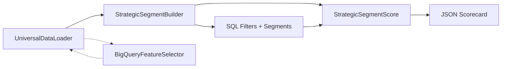
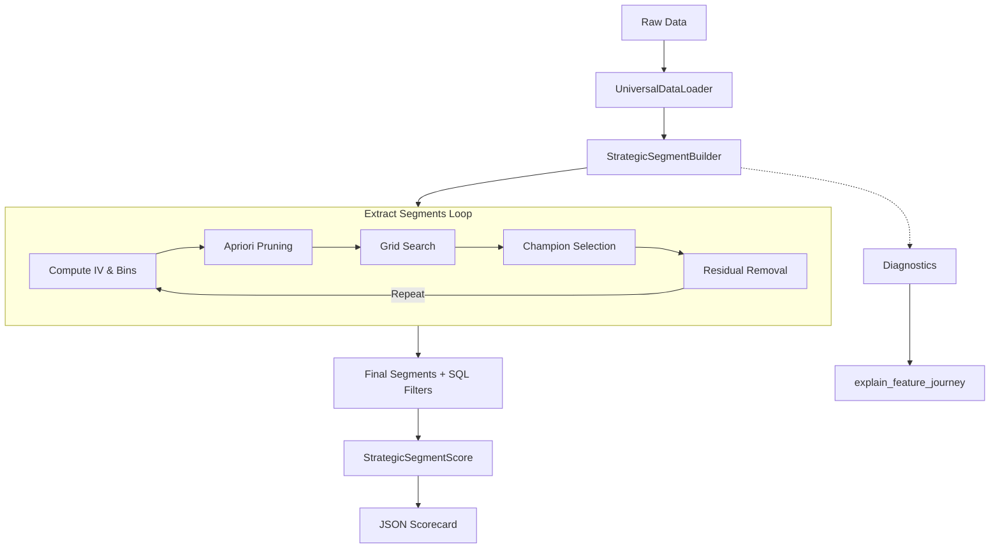

> [!IMPORTANT]
> **Legal Disclaimer**  
> This open‑source library (`RapidSegment`) is an independent, community‑driven predictive analytics framework. It is **completely unaffiliated** with any commercial products, SaaS platforms, or enterprise solutions of the same or similar name. Any overlap in nomenclature is purely coincidental.

<p align="center">
  
</p>

# 🚀 RapidSegment – Strategic Segmentation & Scorecard Engine

[](https://pypi.org/project/rapidsegment/)
[](https://www.python.org/downloads/)
[](https://opensource.org/licenses/MIT)

**RapidSegment** is an industrial‑grade, combinatorial heuristic engine for discovering high‑lift predictive segments and compiling them into transparent, production‑ready scorecards. It bridges the gap between black‑box ML and legacy SQL rules engines.

---

## 📖 Table of Contents
- [✨ Features](#-features)
- [⚡ Quick Start](#-quick-start)
- [🧩 Components](#-components)
- [🏗️ System Architecture](#️-system-architecture)
- [⚙️ How It Works – Step by Step](#️-how-it-works--step-by-step)
- [📊 Statistical Foundations](#-statistical-foundations)
- [🔧 Configuration Reference](#-configuration-reference)
- [🤔 FAQs & Troubleshooting](#-faqs--troubleshooting)
- [🤝 Contributing](#-contributing)
- [📄 License](#-license)

---

## ✨ Features

- **🔎 Automated Rule Discovery** – Uses Optimal Binning + Apriori pruning to find multi‑way (1‑, 2‑, 3‑way) conditions that maximise lift and volume.
- **🧩 Hierarchical Segments** – Extracts mutually exclusive rules sequentially on a shrinking residual dataset, ensuring clean portfolio decomposition.
- **⚡ Hyper‑Efficient** – Leverages **DuckDB** for vectorised SQL aggregations and **NumPy** (or DuckDB’s native quantiles) for blazing‑fast scoring.
- **☁️ BigQuery Ready** – Optional feature screening runs natively inside Google BigQuery, downloading only the most predictive columns.
- **📦 Production‑Ready Outputs** – Exports pure ANSI SQL filters and a JSON scorecard with decile thresholds, ready for deployment.
- **📊 Transparent Weighting** – Uses Lift and Harmonic Mean of Response/Capture rates to compute intuitive, integer weights.
- **🔬 Audit Trail** – Built‑in diagnostic (`explain_feature_journey`) to trace any feature’s lifecycle through the extraction process.

---

## ⚡ Quick Start

```python
import numpy as np
import pandas as pd
import duckdb
from rapidsegment import StrategicSegmentBuilder, StrategicSegmentScore

# 1. Synthetic data (or use your own)
np.random.seed(42)
n = 50_000
data = pd.DataFrame({
    "cust_id": [f"CUST_{i:05d}" for i in range(n)],
    "max_dpd_12m": np.random.choice([0,15,30,60,90], n, p=[0.7,0.15,0.08,0.05,0.02]),
    "utilization_avg_3m": np.random.uniform(0, 1.2, n),
    "risk_segment": np.random.choice(["Low","Medium","High"], n, p=[0.6,0.3,0.1]),
    "default_flag": np.random.choice([0,1], n, p=[0.95,0.05])
})

# Inject a strong rule to verify extraction
mask = (data["max_dpd_12m"] >= 60) & (data["utilization_avg_3m"] >= 0.85)
data.loc[mask, "default_flag"] = np.random.choice([0,1], mask.sum(), p=[0.2,0.8])

# 2. Configure the builder
builder = StrategicSegmentBuilder(
    target="default_flag",
    top_n_vars=15,
    max_segments=5,
    max_feature_reuse=1,
    param_grid={"min_sample_size": [1000,2500,5000], "min_lift": [2.0,3.5,5.0]},
    enable_diversity=True,
    feature_groups={
        "delinquency": ["max_dpd_12m", "risk_segment"],
        "utilization": ["utilization_avg_3m"]
    },
    ignore_features=["cust_id"]
)

# 3. Extract hierarchical segments
segments = builder.extract_segments(data)
print(pd.DataFrame(segments)[["segment_id","count","lift","sql_filter"]])

# 4. Audit a feature's journey
builder.explain_feature_journey("max_dpd_12m")

# 5. Build scorecard
segment_cols = []
scoring_df = data[["cust_id","default_flag"]].copy()
for seg in segments:
    col = f"SEG_{seg['segment_id']}"
    scoring_df[col] = duckdb.sql(f"SELECT ({seg['sql_filter']}) FROM data").df().astype(int)
    segment_cols.append(col)

scorer = StrategicSegmentScore(target_col="default_flag", primary_key="cust_id", segment_cols=segment_cols)
model = scorer.calculate_and_export_weights(scoring_df, "model.json")

print("Deciles:", model["decile_min_thresholds"])
```
## 🧩 Components

RapidSegment is built from four decoupled, specialised modules. They can be used together or independently, depending on your pipeline needs.



| Component | Purpose |
|-----------|---------|
| **`StrategicSegmentBuilder`** | Finds high‑lift rules using Apriori pruning and grid search, outputs SQL filters. |
| **`StrategicSegmentScore`** | Converts binary segment flags into a weighted scorecard with decile thresholds. |
| **`BigQueryFeatureSelector`** | Screens hundreds of features in BigQuery using IV and variance filters. |
| **`UniversalDataLoader`** | Ingests CSV, Parquet, Excel, Arrow, and BigQuery tables into PyArrow tables. |

### 📥 `UniversalDataLoader`
- **Purpose**: Ingests data from multiple sources and normalises it into a PyArrow Table.
- **Supports**: CSV, Parquet, Arrow/Feather, Excel, and BigQuery (via streaming).
- **Key Benefit**: Automatically casts numeric columns to `float64` for consistent precision downstream.

### 🔍 `StrategicSegmentBuilder`
- **Purpose**: The core segmentation engine. It discovers high‑lift rules using Optimal Binning + Apriori pruning + grid search.
- **Outputs**: A list of segments, each with a pure ANSI SQL `WHERE` clause, plus metrics (count, rate, lift).
- **Unique Feature**: Built‑in diagnostic (`explain_feature_journey`) to audit feature usage across iterations.

### 📊 `StrategicSegmentScore`
- **Purpose**: Converts binary segment flags into a weighted scorecard with decile thresholds.
- **Weighting**: Uses Lift × Harmonic Mean of Response/Capture rates.
- **Output**: A JSON artifact containing model metadata, segment weights, and decile cutoffs.
- **Zero‑Inflation**: Automatically isolates the active population if ≥80% of scores are zero.

### ☁️ `BigQueryFeatureSelector`
- **Purpose**: Screens hundreds of features directly inside Google BigQuery using IV and variance filters.
- **Benefit**: Only downloads features that meet the thresholds, saving network and memory costs.
- **Integration**: Returns a DuckDB relation of retained feature names and their IVs.

### Quick‑Reference Matrix

| Component | Primary Role | Key Output | Data Format |
|-----------|--------------|------------|-------------|
| `UniversalDataLoader` | Ingestion | PyArrow Table | CSV, Parquet, Excel, Arrow, BQ |
| `StrategicSegmentBuilder` | Rule Discovery | Segment SQL + Metrics | List of dicts |
| `StrategicSegmentScore` | Scorecard Compilation | JSON Model | JSON file |
| `BigQueryFeatureSelector` | Feature Screening | Filtered Feature List | DuckDB relation |

---

## 🏗️ System Architecture

Below is the high‑level flow of the entire pipeline, from raw data to a deployable scorecard.



## ⚙️ How It Works – Step by Step

### 1. Feature Ranking & Binning
Optimal Binning (via `optbinning`) computes the Information Value (IV) for each feature, automatically handling categorical and numerical types. Only the top `top_n_vars` features proceed.

### 2. Apriori Pruning
The engine evaluates combinations in a layered fashion:


If a 1‑way rule fails the thresholds, all higher‑order combinations containing that feature are pruned – drastically reducing the search space.

### 3. Grid Search
For each iteration, the engine sweeps over a user‑defined grid of `(min_sample_size, min_lift)` values. Each grid point produces a candidate champion. After all grid points are evaluated, the global champion is chosen by sorting on `(lift, count, rate)`.

### 4. Champion Validation & Extraction
The champion’s SQL filter is validated against the **raw residual** to ensure it meets the absolute hard constraints. Only then is it accepted.

### 5. Residual Update (NULL‑safe)
Rows matching the rule are removed using:
```sql
WHERE NOT (rule) OR (rule) IS NULL
```
This guarantees that the residual dataset exactly matches the `CASE`‑based hierarchical segmentation used in `evaluate_final_coverage`.

### 6. Loop
Steps 1‑5 repeat until either `max_segments` is reached or no more rules can be found.

### 7. Scorecard Compilation
Once all segments are extracted, they are converted to binary flags and passed to `StrategicSegmentScore`. This module computes weights using the Harmonic Mean formula and calibrates decile thresholds (with automatic zero‑inflation handling).

---

## 📊 Statistical Foundations

### Information Value (IV)
* **WOE (Weight of Evidence)**: Measures the predictive power of an individual bin relative to the overall baseline population. It establishes how much a specific value band shifts the log-odds of an event occurring:
  $$WOE = \ln \left( \frac{\text{Percent of Non-Events}}{\text{Percent of Events}} \right)$$
* **IV (Information Value)**: Summarizes the overall predictive power of the entire variable across all its discrete bins:
  $$IV = \sum \left( \text{Percent of Non-Events} - \text{Percent of Events} \right) \times WOE$$
  
Variables with $IV \times 100 > 30$ are considered **strong** predictors.

### Segment Weight Calculation
For a segment $s$:

- **Response Rate**: $RR_s = \frac{Events_s}{Count_s}$  
- **Capture Rate**: $CR_s = \frac{Events_s}{TotalEvents}$  
- **Lift**: $L_s = \frac{RR_s}{BaselineRate}$

The weight is:

$$
\text{Weight}_s = \left\lfloor \, L_s \times 2 \cdot \frac{RR_s \cdot CR_s}{RR_s + CR_s} \times 100 \right\rfloor
$$

**Why Harmonic Mean?**  
It balances the density of the segment (Capture Rate) and its risk concentration (Response Rate), preventing extreme values from dominating the score.

### Decile Calibration
Scores are computed as the sum of weights for all segments a customer triggers.  
Customers are sorted in **descending** order; deciles are formed by splitting the population into 10 equal‑sized buckets.  
**Zero‑Inflation handling**: If $\ge$ 80% of customers have a score of 0, deciles are calculated **only on the active (score > 0)** population. This prevents a long tail of zeros from flattening the scorecard.

---

## 🔧 Configuration Reference

### `StrategicSegmentBuilder`

| Parameter | Type | Default | Description |
|-----------|------|---------|-------------|
| `target` | `str` | **Required** | Binary target column name. |
| `n_jobs` | `int` | `-1` | Number of parallel workers. |
| `min_sample_size` | `int` | `1000` | Minimum rows for a rule. |
| `min_lift` | `float` | `2.0` | Minimum lift ratio. |
| `min_events` | `int` | `5` | Minimum positive events. |
| `top_n_vars` | `int` | `20` | Number of top‑IV features to consider. |
| `max_segments` | `int` | `10` | Maximum segments to extract. |
| `max_feature_reuse` | `int` | `1` | How many times a feature can appear. |
| `enable_diversity` | `bool` | `False` | Prevent same‑group feature combinations. |
| `enable_1way/2way/3way` | `bool` | `True` | Toggle rule complexity levels. |
| `feature_groups` | `dict` | `{}` | Business‑category mapping for diversity. |
| `ignore_features` | `list` | `[]` | Columns to drop before processing. |
| `sort_priority` | `STR` | `lift_count_rate` | Order in which rules will ranked and selected. Sample capture heavy/Response Rate Heavy/Lift Heavy. |

**Output** – list of dicts with keys: `segment_id`, `rule_string`, `sql_filter`, `count`, `rate`, `lift`, `meta_applied_sample_size`, `meta_applied_min_lift`.

### `StrategicSegmentScore`

| Parameter | Type | Description |
|-----------|------|-------------|
| `target_col` | `str` | Binary target column. |
| `primary_key` | `str` | Unique row identifier. |
| `segment_cols` | `list` | List of binary segment flag columns. |

**Export** – JSON artifact with `model_metadata`, `segment_weights`, `decile_min_thresholds`.

---

## 🤔 FAQs & Troubleshooting

**Q: Why are later segments sometimes stronger in lift than earlier ones?**  
A: The engine optimises locally on the residual population. As the baseline shifts, a rule that captures a very specific tail can exhibit higher lift than the previous rule, even though it covers fewer rows. This is normal.

**Q: My deciles 3+ have a threshold of 0 – what’s wrong?**  
A: This indicates high zero‑inflation in the scored dataset (most customers triggered no rules). Relax constraints: increase `max_feature_reuse`, lower `min_lift`/`min_sample_size`, or disable diversity to allow more segment coverage.

**Q: Why doesn’t the engine support OR‑based rules?**  
A: OR breaks the Apriori pruning property: if A fails and B fails, A AND B will also fail (prune safe), but A OR B might succeed – forcing an exhaustive search. The engine prioritises speed and stability by focusing on AND‑based intersections.

**Q: Can I use my own data loader?**  
A: Yes – just pass a DuckDB‑compatible table (e.g., a Pandas DataFrame) directly to `extract_segments()` or `calculate_and_export_weights()`.

**Q: Does the engine handle missing values (NULLs) correctly?**  
A: Yes. Both extraction and evaluation treat NULLs consistently – NULL conditions do not match the rule and are carried forward to later segments (or the `ELSE 0` bucket).

---

## 🤝 Contributing

We welcome contributions! Please open an issue or pull request on [GitHub](https://github.com/your-org/rapidsegment).  
For major changes, please discuss them first via an issue.

---

## 📄 License

This project is licensed under the MIT License – see the [LICENSE](LICENSE) file for details.

---

**Built with ❤️ by Bishwarup Biswas, Gemini & DeepSeek.**  
Special Thanks to Mr. [Guillermo Navas Palencia](https://github.com/guillermo-navas-palencia)  for creating [Optbinning](https://github.com/guillermo-navas-palencia/optbinning) library.

_Independent, open‑source, and ready for production._
```
